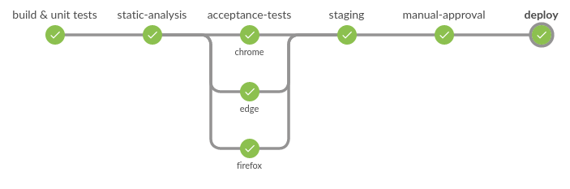
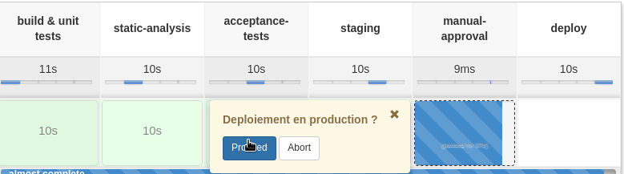

= Atelier Jenkins Pipeline

== Workshop #1 - Jenkins Pipeline basics

Goals : play with new features offered by Jenkins Pipeline in "Scripted" mode

=== HelloWorldeuCon'

* Authenticate to your Jenkins with provided credentials

* Create a new Pipeline job

NOTE: if you haven't seen Jenkins 2 yet, you can observe that Job configuration is now available with tabs, much more convenient than before !

* In the Pipeline section, click on the `Pipeline Syntax` link.

On this page, you can see some tools which can help you creating your Pipeline.

Go on `Snippet Generator` page. This tool will help you generate automatically some DSL portions by selecting and filling required fields.

On the other menu, you can find some Pipeline documentation.

All this stuff will our reference for the rest if the workshop.

* Go back to your job configuration, and go to the `Definition` section, click on "Try sample Pipeline ..." and select `GitHub + Maven`.

* Save and start a build.

The target project will be fetched, built, tested and archived on Jenkins.
On the job main page, you will see a visualization of the pipeline triggered with link:https://wiki.jenkins-ci.org/display/JENKINS/Pipeline+Stage+View+Plugin[Pipeline Stage View Plugin].

Your job is yellow or red ? Check the build logs but this is an expected behaviour : the Maven build of this project triggers some unit tests which randomly returned different results.
Trigger some new builds and results should be different :-)

Congratulations ! You have triggered your first Jenkins Pipeline !

* On a build page, re-run your job using the `Replay` button on the left menu

Jenkins displays the Pipeline script used by the current build and let you add some modifications before trigger a new build again.
Do a small modification (add `echo` for example) to the Pipeline script, and then click on `Run` button.

NOTE: the `Replay` button is extremely useful when you are in development mode : it avoids you to save your job configuration systematically before testing your modification.
And even more if you are working on a _Multibranch Pipeline_ (we will see this kind of job later).

Once the build is done, go to the build page and click on "Replayed \#X (`diff`)" link. Jenkins shows you the difference that you have added the Pipeline.

TIP: Jenkins keeps the Pipeline script used for all your builds.

=== Autocompletion of scripted Pipeline with IntelliJ IDEA GDSL

NOTE: this step is not mandatory, we are not expecting you to have IntelliJ IDEA installed locally, especially at the EclipseCon France conference :-)

* Open IntelliJ IDEA and create a new Groovy project créer un nouveau projet de type Groovy
* On Jenkins, got to `Pipeline Syntax` page and copy the content of the `IntelliJ IDEA GDSL` page
* Create a new file `autocompletion.gdsl` on the `src` directory and copy the copied content
* Create a file `pipeline.groovy` inside `src` directory and try to autocomplete things inside
* IntelliJ IDEA should help you with autocompletion of methods available on scripted Jenkins Pipeline (Ctrl+Space)

TIP: IntelliJ should propose you to activate GDSL module after the `autocompletion.gdsl` file creation

TIP: Article about GDSL : http://www.tothenew.com/blog/gdsl-awesomeness-introduction-to-gdsl-in-intellij-idea/

=== Create our Pipeline structure

This part goal is to create and "empty" pipeline (without real build/test). We just want to play with Jenkins Pipeline capabilities for the moment.

You to fulfill the following requirements :

* The final result must looks like the following on Blue Ocean :

* Between the `staging` and `deploy` stages, the step `manual-approval` permit to ask a manual action to approve the deployment.
Add an `input` permitting to approve or not the deployment.

* The `build & unit tests`, `static-analysis` stages must allocate and agent with the `build` label and do a `sleep` of 5s.

* The `tests` stage must parallelize three tasks : `chrome`, `edge` and `firefox`, each one needs to do a sleep of 5s on a different node (any label)

* The stages `staging` and `deploy` must allocate any agent and do a `sleep` of 5s

NOTE: This exercise is not detailed on purpose.

You can find some documentation on the `Pipeline Syntax` page. The following links can also be useful :

* link:https://www.cloudbees.com/blog/parallelism-and-distributed-builds-jenkins[Parallelism and Distributed Builds with Jenkins]
* link:https://github.com/jenkinsci/pipeline-plugin/blob/master/TUTORIAL.md#using-agents[Using Agent]
* link:https://github.com/jenkinsci/pipeline-plugin/blob/master/TUTORIAL.md#pausing-flyweight-vs-heavyweight-executors[Flyweight vs. Heavyweight Executors]
